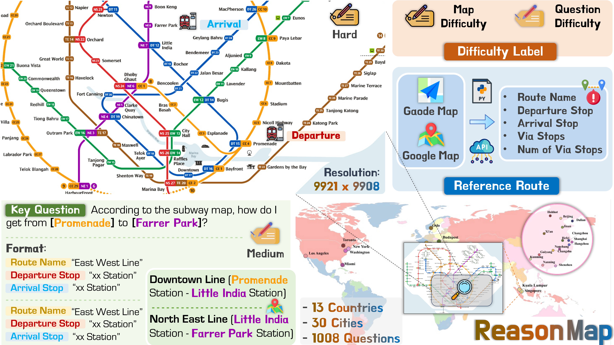

<div align="center">

  <h2><b> Can MLLMs Guide Me Home? A Benchmark Study on Fine-Grained Visual Reasoning from Transit Maps </b></h2>
  <h4> A Fine-Grained Visual Reasoning Benchmark: ReasonMap</h4>

</div>


<div align="center">


<a href="https://arxiv.org/abs/2505.18675" target="_blank"></a>

</div>

<div align="center">

**[<a href="https://arxiv.org/abs/2505.18675">arXiv</a>]** **[<a href="https://huggingface.co/collections/FSCCS/reasonmap-688517b57d771707a5d64656">Dataset</a>]** **[<a href="https://x.com/si_feng32704/status/1927186378900533309">X</a>]**

</div>


---
>
> 🙋 Please let us know if you find out a mistake or have any suggestions!
> 
> 🌟 If you find this resource helpful, please consider to star this repository and cite our [research](#citation)!

<p align="center">

</p>


## Updates

- 2025-09-30: 🚀 We released [ReasonMap-Plus](https://huggingface.co/datasets/FSCCS/ReasonMap-Plus) for the following research - [RewardMap](https://github.com/fscdc/RewardMap)!
- 2025-05-15: 🚀 We released evaluation code and our [website](https://fscdc.github.io/ReasonMap/) online!
- 2025-05-15: 🚀 We released [ReasonMap](https://huggingface.co/datasets/FSCCS/ReasonMap)!


## Usage

### 1. Install dependencies

If you face any issues with the installation, please feel free to open an issue. We will try our best to help you.

```bash
conda env create -f reasonmap-py310.yaml
```

### 2. Download the dataset
You can download [ReasonMap](https://huggingface.co/datasets/FSCCS/ReasonMap) and [ReasonMap-Plus](https://huggingface.co/datasets/FSCCS/ReasonMap-Plus) from HuggingFace.


### 3. Evaluation
You can evaluate the model performance on ReasonMap by running the following command:
```bash
## ReasonMap Evaluation
# open-source models
bash script/run.sh
# closed-source models
bash script/run-closed-models.sh

## ReasonMap-Plus Evaluation
bash script/run_plus.sh

# after running the above scripts, you can analyze the results by:
python cal_metrics.py
```

## Citation
If you find this benchmark useful in your research, please consider citing our paper:

```bibtex
@article{feng2025can,
  title={Can MLLMs Guide Me Home? A Benchmark Study on Fine-Grained Visual Reasoning from Transit Maps},
  author={Feng, Sicheng and Wang, Song and Ouyang, Shuyi and Kong, Lingdong and Song, Zikai and Zhu, Jianke and Wang, Huan and Wang, Xinchao},
  journal={arXiv preprint arXiv:2505.18675},
  year={2025}
}

# further research
@article{feng2025rewardmap,
  title={RewardMap: Tackling Sparse Rewards in Fine-grained Visual Reasoning via Multi-Stage Reinforcement Learning},
  author={Feng, Sicheng and Tuo, Kaiwen and Wang, Song and Kong, Lingdong and Zhu, Jianke and Wang, Huan},
  journal={arXiv preprint arXiv:2510.02240},
  year={2025}
}
```